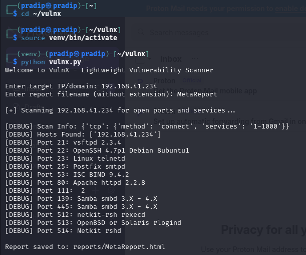
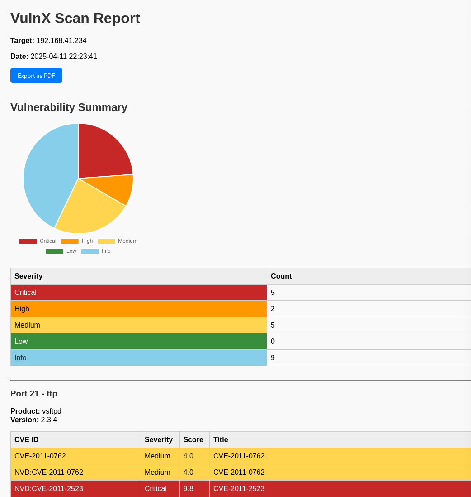

# VulnX – Lightweight Vulnerability Scanner (Nmap + CVE Lookup)

**VulnX** is a Python-based vulnerability scanner inspired by Nessus, tailored for ethical hacking labs and practical vulnerability assessments. It combines Nmap for deep port/service detection and Vulners API for CVE lookups. The results are displayed in a well-structured HTML report with severity-based pie charts and export-to-PDF support.

---

## Features

- Full port scan with service detection using Nmap (`-sV -p-`)
- Fetches top 5 related CVEs for each service using Vulners
- Severity classification: Critical, High, Medium, Low, Info
- Interactive HTML report with Pie Chart and Severity Table
- One-click Export as PDF (print-to-PDF via browser)
- Terminal prompts for clean user experience

---

## Project Structure

```
vulnx/
├── vulnx.py                 # Main scanner script
├── requirements.txt         # Python dependencies
├── reports/                 # Saved HTML scan reports
├── screenshots/             # Screenshots of process and results
├── LICENSE                  # License file
└── README.md                # This file
```

---

## Installation & Setup

### Prerequisites
Install required system tools:
```bash
sudo apt update
sudo apt install nmap python3 python3-venv curl -y
```

### Clone the Repository
```bash
git clone https://github.com/YOUR_USERNAME/vulnx.git
cd vulnx
```

### Set up Virtual Environment
```bash
python3 -m venv venv
source venv/bin/activate   # Linux/macOS
# .\venv\Scripts\activate   # Windows
```

### Install Python Packages
```bash
pip install -r requirements.txt
```

---

## Configure Vulners API Key

1. Register at [Vulners](https://vulners.com)
2. Go to **Your Account → API Key**
3. In `vulnx.py`, replace the API key placeholder:
```python
vulners = VulnersApi(api_key="YOUR ACTUAL API KEY")
```

---

## Usage

Run the scanner:
```bash
python vulnx.py
```

You'll be prompted to enter:
- **Target IP or Domain** (e.g., `192.168.41.234`)
- **Report file name** (without `.html` extension)

### Example:
```
 Enter target IP/domain: 192.168.41.234
 Enter report filename (without extension): metasploitable2
```

Output saved to:
```
reports/metasploitable2.html
```
Open the file in your browser and click **Export as PDF**.

---

## Screenshots

### How to run it:


### Example Report Output as html file:



---

## What's in the Report?

- Pie chart with severity breakdown
- Table of CVEs by severity: Critical / High / Medium / Low / Info
- Port-based section with:
  - Port, service name, product/version
  - CVE ID, severity, CVSS score, and description

---

## Legal Disclaimer
> This tool is meant for **authorized security testing and educational use only**.
> **Do not scan systems** you don’t own or have explicit permission to assess.

---

## Author

**Pradip Sapkota**  
📧 pradipsapkota676@gmail.com  
🌐 [GitHub](https://github.com/YOUR_USERNAME)

---

## Support
If you like this project, please ⭐ it and share it with fellow cybersecurity learners!

